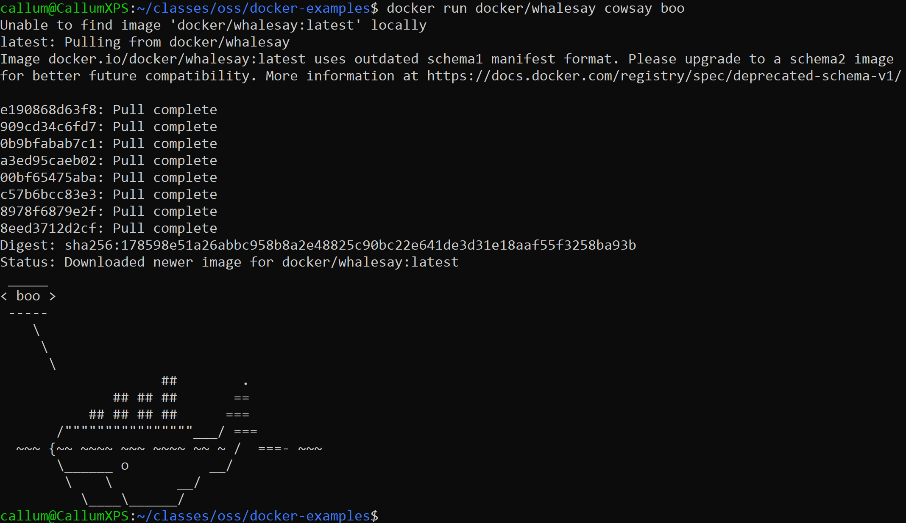
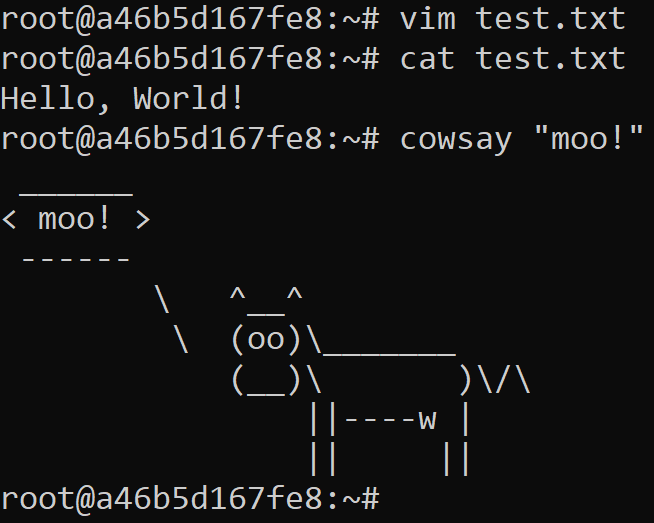
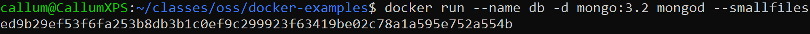
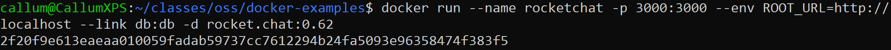
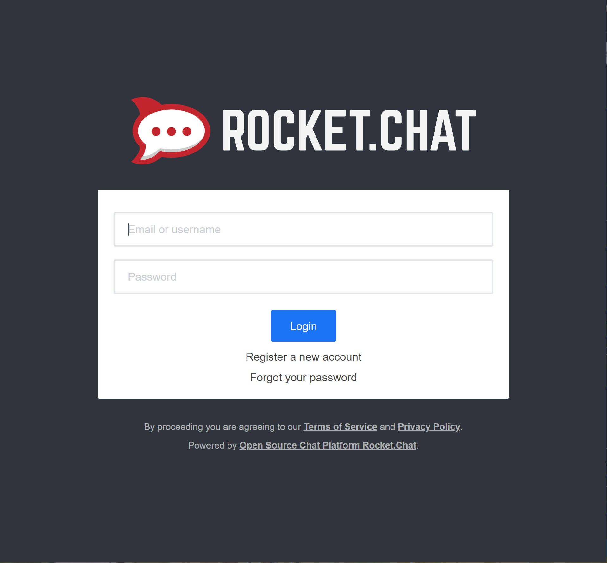
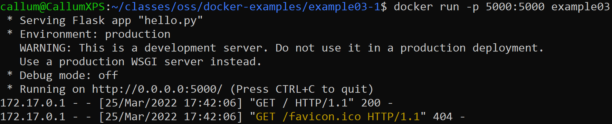
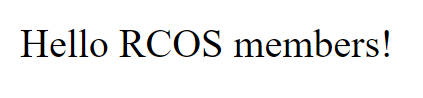
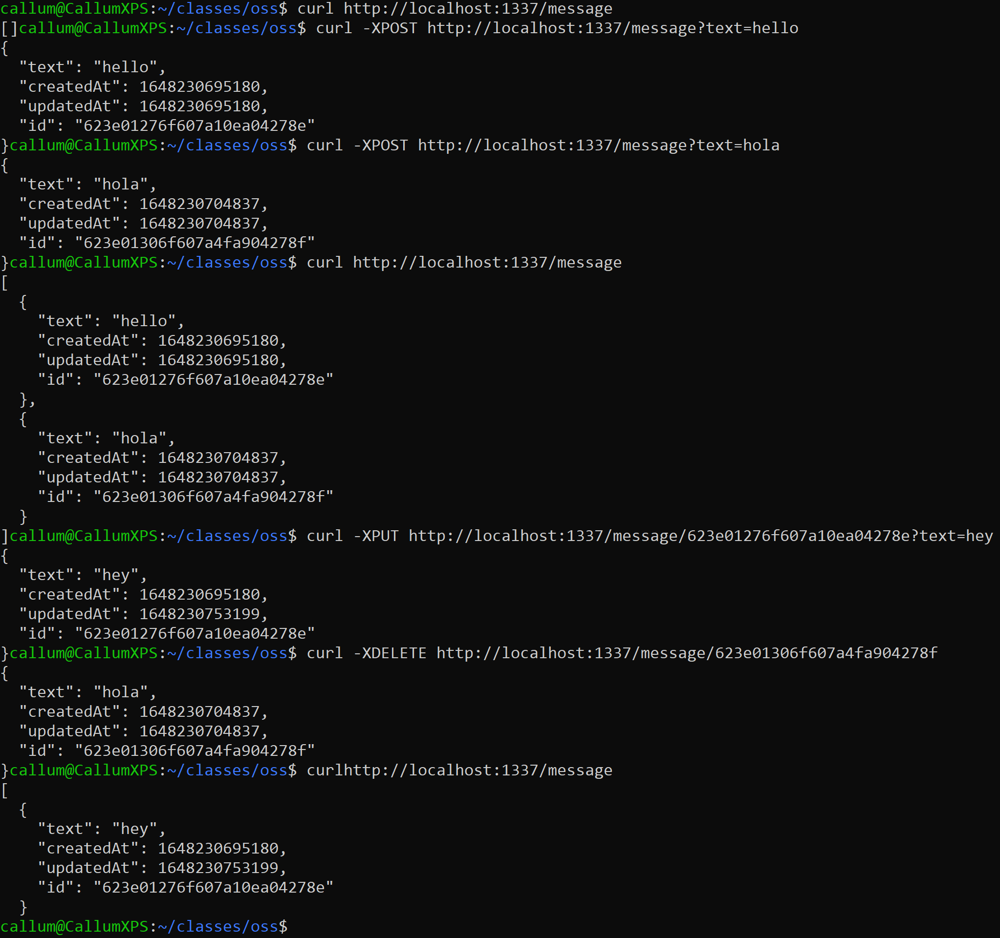

# Lab 09 - Virtualization

## Docker Examples
## Example 00

## Example 01

## Example 02
### Command Line - Mongo and Rocketchat

### Rocketchat Frontend

## Example 03
### Command Line

### Browser View

## Example 04

