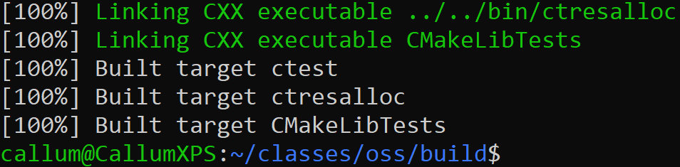
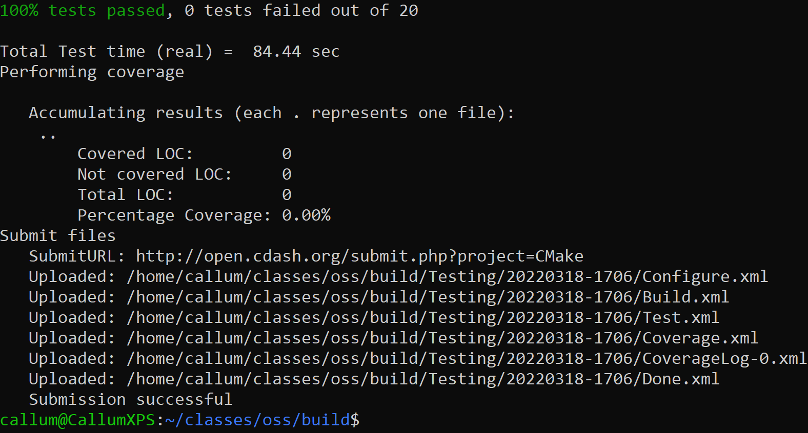
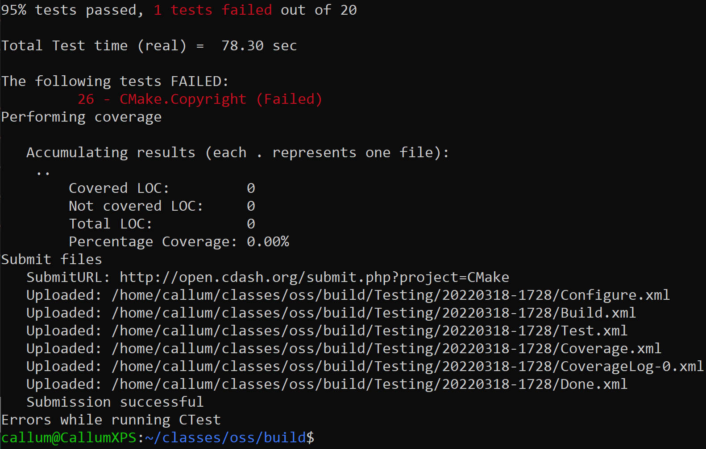
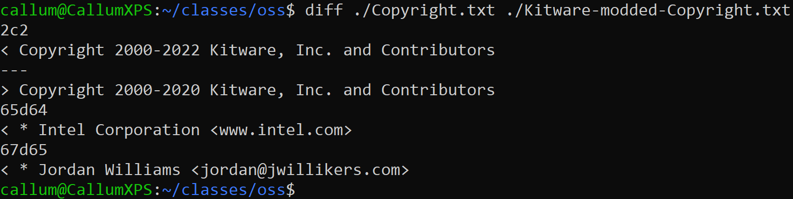
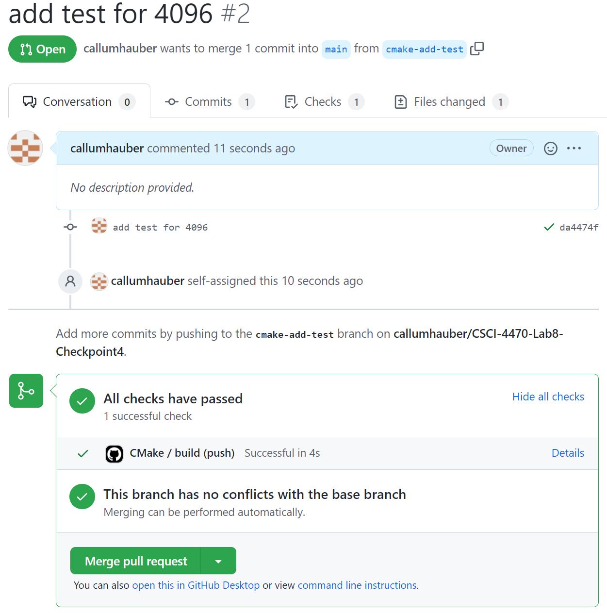

# Lab 8 - Testing and Continuous Integration

## Checkpoint 1

## Checkpoint 2
Find the Nightly and Experimental sections and look at some of the submissions. How can you see what tests were run for a particular submission?
- You can click on the build name link, then scroll down to the testing section and click on the "view tests summary" link to see a summary of which tests were run and the pass/fail results of those tests.

Find a submission with errors. Can you see what the error condition was? How does this help you debug the failure?
- When viewing the tests summar, you can click on the test name to see the details of that specific test. For build `Solaris-10-sparc_DevStudio12u6 (unstable10s.opencsw.org) on 2022-03-18 06:09:01` I can see that the failed test was `BootstrapTest`. Seeing the error condition helps narrow my search when I'm trying to debug the code. There's an error log that could also help narrow down a lot more, but it's difficult for me to read.

Find a system that is close to your specific configuration in the Nightly, Nightly Expected or one of the Masters sections. How clean is the dashboard? Are there any errors that you need to be concerned with?
- I found Ubuntu 20.04.2, which is close to my configuration because I have Ubuntu 21.10, link here: https://open.cdash.org/build/7800889. The dashboard is very clean, and there aren't any errors or warnings, so I don't think I need to be concerned about anything. 689 tests passed, 0 failed, 0 not run.

#### Screenshot of Test Submission

## Checkpoint 3

#### Screenshot of Submission With Errors

#### Screenshot of Fix and Successful Run

## Checkpoint 4

[Link to Repo](https://github.com/callumhauber/CSCI-4470-Lab8-Checkpoint4)

