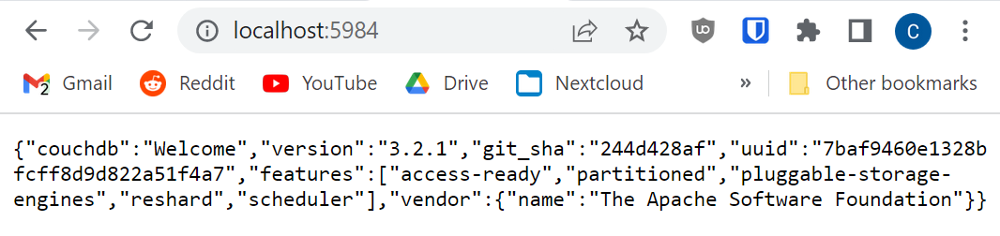
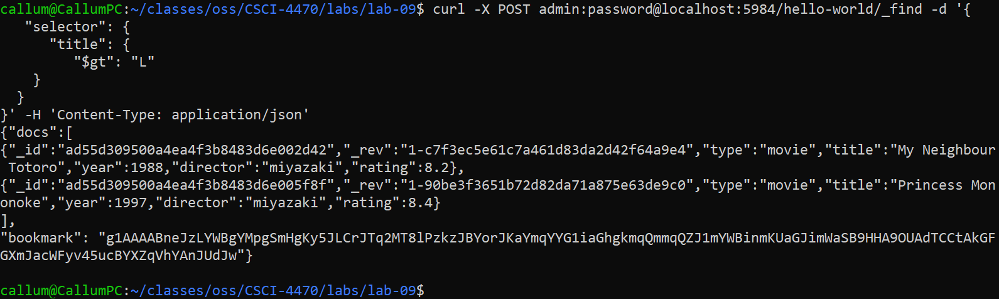

# Lab 09 - Databases

## Checkpoint 0
https://github.com/callumhauber/CSCI-4470/wiki/Lab-9-Checkpoint-0

## Checkpoint 1


## Checkpoint 2
### 1.6.1


### 1.6.2


### 1.6.3


### 1.6.4


### 1.6.5


## Checkpoint 3
### 1.7.1


### 1.7.2


### 1.7.3


### 1.7.4


## Checkpoint 4
### Part 1


### Part 2
#### Command
```bash
curl -X POST admin:password@localhost:5984/hello-world/_find -d '{
   "selector": {
      "title": {
         "$gt": "L"
    }
  }
}' -H 'Content-Type: application/json'
```


### Part 3


### Part 4
#### Command
```bash
curl -X POST admin:password@localhost:5984/hello-world/_index -d '{
   "index": {
      "fields": [
         "title"
      ]
   },
   "name": "title-json-index",
   "type": "json"
}' -H 'Content-Type: application/json'
```
