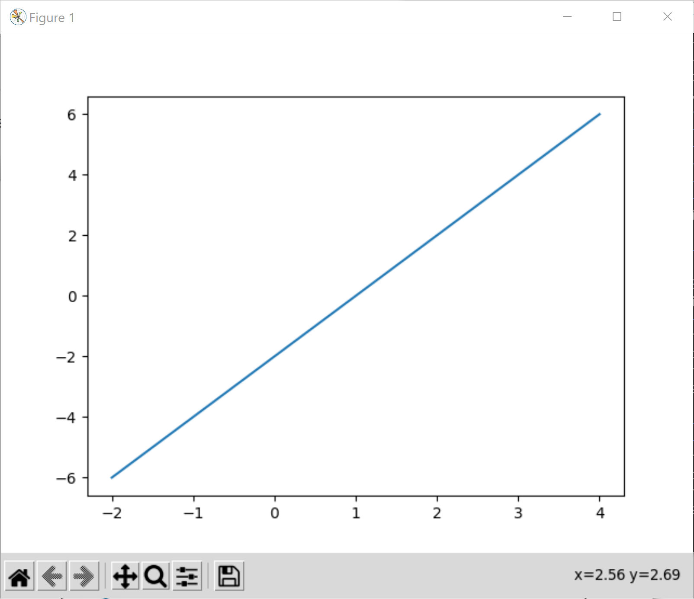
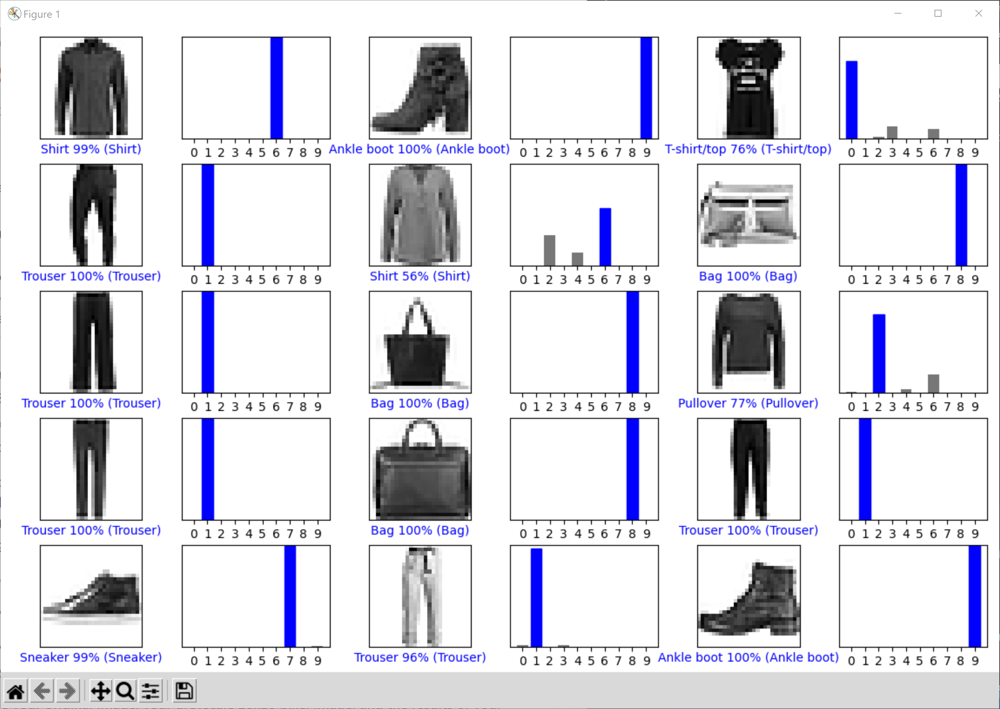
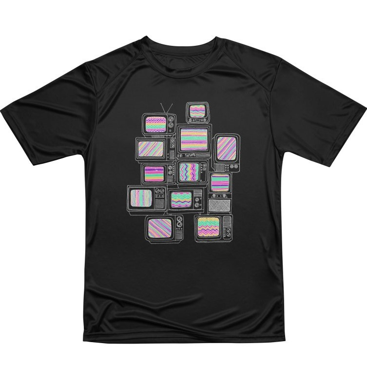
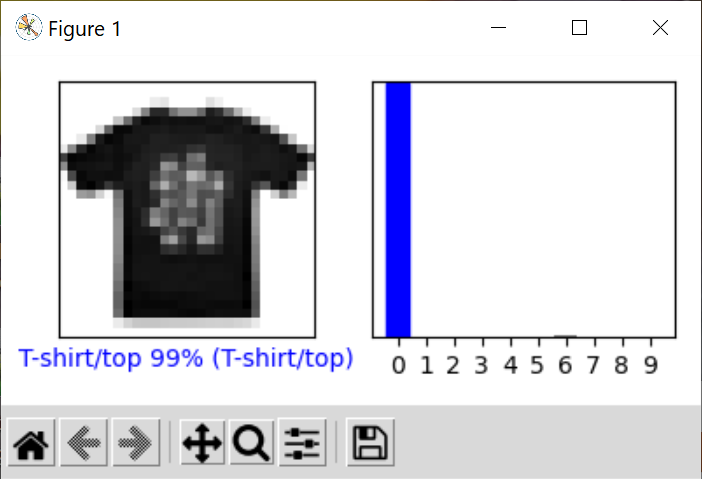
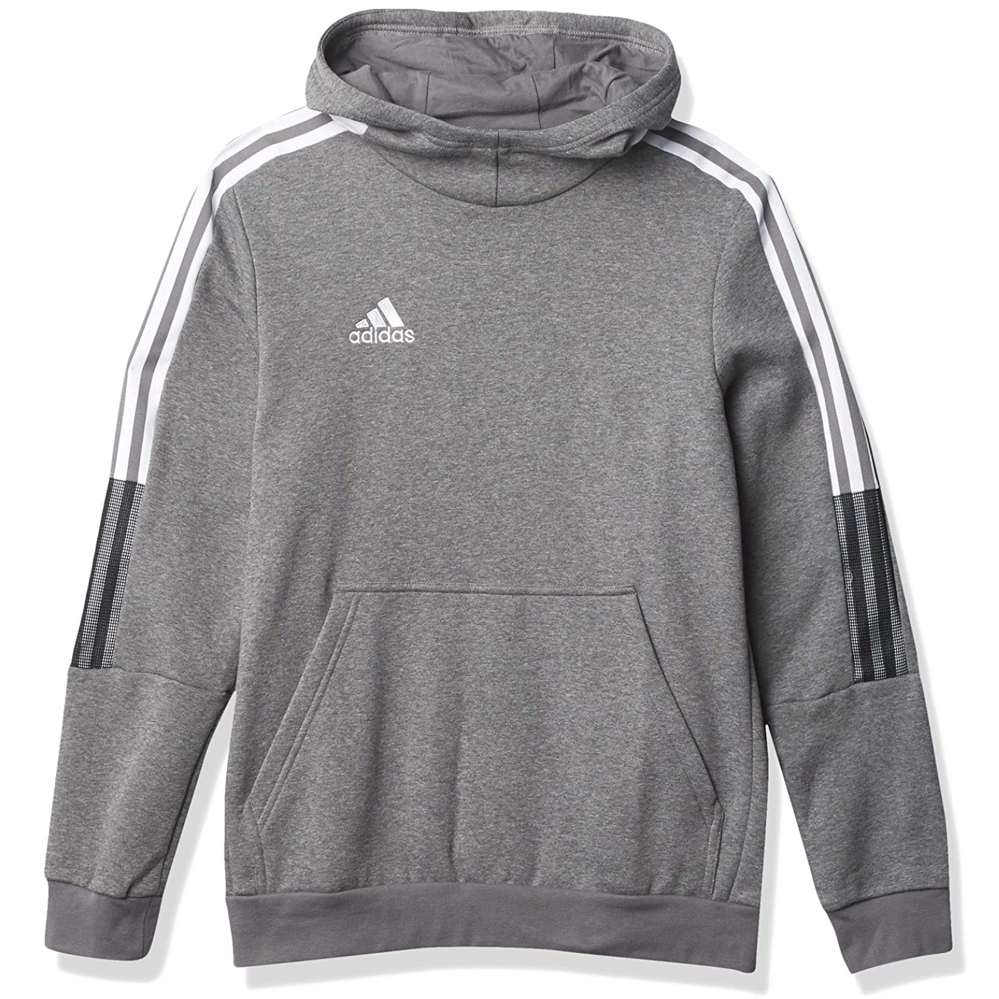
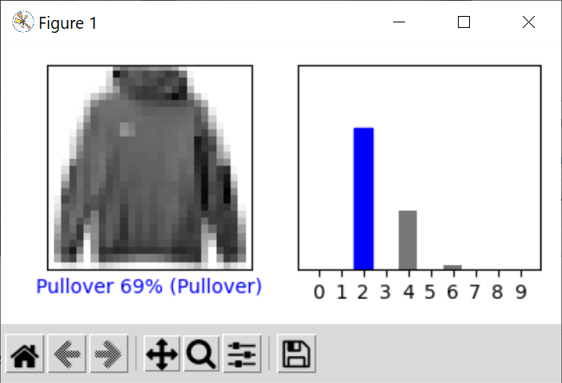
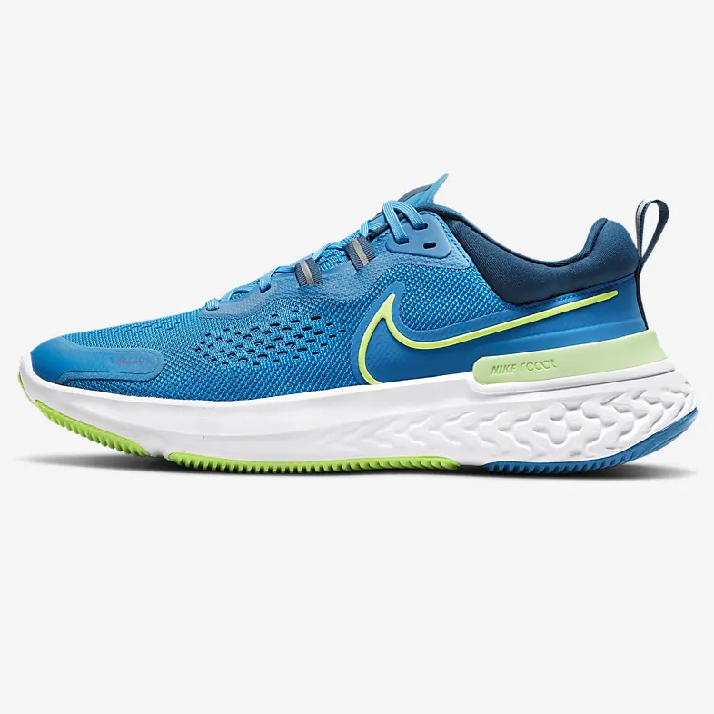
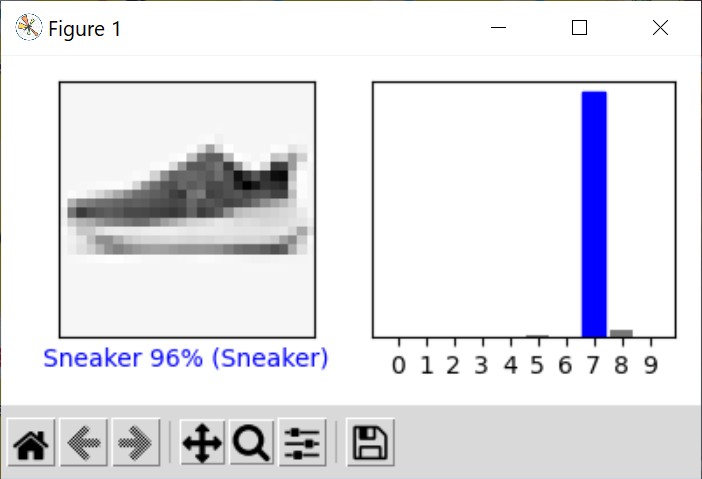

# Lab 10 - TensorFlow

## Checkpoint 1

## Checkpoint 2

## Checkpoint 3
### Shirt
#### Original Image

#### Results

    [9.9195111e-01 2.5866406e-10 3.3489190e-04 2.1466269e-06 5.6823566e-05
    7.4517611e-17 7.6548741e-03 2.3115493e-25 1.5687147e-07 4.2958388e-16]

### Hoodie
#### Original Image

#### Results

    [1.34523527e-03 4.58837150e-07 6.89588249e-01 3.30639799e-04
    2.88489670e-01 1.26008795e-08 2.01198105e-02 4.07816287e-08
    9.41016770e-05 3.18713501e-05]

### Shoe/Sneaker
#### Original Image

#### Results

    [3.5593472e-03 2.1158064e-04 8.2785246e-04 5.0926837e-04 9.4419018e-05
    8.4318398e-03 2.3474472e-04 9.5728540e-01 2.6632145e-02 2.2133226e-03]
